# AI Recommendation Flow Visualization

## 📊 System Architecture Diagram


## 🔄 Scoring Algorithm Detail


## 💬 Example Scenarios

### Scenario 1: High Anxiety Crisis

```mermaid
sequenceDiagram
    participant User
    participant UI as CopingTools UI
    participant Engine as Recommendation Engine
    participant Data as Local Storage
    
    User->>UI: Opens Coping Tools page
    UI->>Data: Fetch checkIns + chatTags
    Data-->>UI: mood="anxious", chat="panic attack"
    
    UI->>Engine: buildRecommendationContext()
    Engine-->>UI: {currentMood: "anxious", <br/>moodIntensity: 8, <br/>keywords: ["panic"]}
    
    UI->>Engine: getRecommendedCopingTools()
    Engine->>Engine: Score Box Breathing → 90
    Engine->>Engine: Score 5-4-3-2-1 → 85
    Engine->>Engine: Score 4-7-8 → 75
    Engine-->>UI: Sorted recommendations
    
    UI->>User: Display "Box Breathing" first<br/>💡 Suggested because you felt<br/>anxious and mentioned panic
    
    User->>UI: Clicks Box Breathing
    UI->>User: Opens breathing dialog
    User->>User: Completes 4-4-4-4 breathing
```


### Scenario 2: Low Mood with Chat Context

```mermaid
sequenceDiagram
    participant User
    participant UI as CopingTools UI
    participant Engine as Recommendation Engine
    participant Data as Local Storage
    
    User->>UI: Opens Coping Tools page
    UI->>Data: Fetch checkIns + chatTags
    Data-->>UI: mood="sad", chat="hopeless"
    
    UI->>Engine: buildRecommendationContext()
    Engine-->>UI: {currentMood: "sad", <br/>moodIntensity: 6, <br/>keywords: ["hopeless"]}
    
    UI->>Engine: getRecommendedCopingTools()
    Engine->>Engine: Score Self-Compassion → 85
    Engine->>Engine: Score Cognitive Reframing → 80
    Engine->>Engine: Score Gratitude → 70
    Engine-->>UI: Sorted recommendations
    
    UI->>User: Display "Self-Compassion" first<br/>💡 Suggested because you expressed<br/>feelings of sadness
    
    User->>UI: Clicks Self-Compassion
    UI->>User: Opens compassion dialog
    User->>User: Reads affirmations
```


## 🎯 Data Flow Summary

```mermaid
graph LR
    A[User Data] --> B[Check-Ins<br/>mood: anxious<br/>createdAt: today]
    A --> C[Chat Tags<br/>tag: panic<br/>context: overwhelmed]
    
    B --> D[Recommendation<br/>Context]
    C --> D
    
    D --> E[currentMood: anxious<br/>moodIntensity: 8<br/>chatSummary: panic...<br/>keywords: [panic]]
    
    E --> F[Scoring Engine]
    
    F --> G[Tool 1<br/>Score: 90<br/>Reason: ...]
    F --> H[Tool 2<br/>Score: 85<br/>Reason: ...]
    F --> I[Tool 3<br/>Score: 75<br/>Reason: ...]
    
    G --> J[Sorted<br/>Recommendations]
    H --> J
    I --> J
    
    J --> K[UI Display]
    
    style A fill:#e3f2fd
    style D fill:#fff3e0
    style F fill:#fce4ec
    style J fill:#e8f5e9
    style K fill:#f3e5f5
```

## 📊 Clinical Validation Flow


---

## 📝 Notes

- All diagrams use Mermaid syntax for version control
- Flow reflects actual code implementation in `copingRecommendation.ts`
- Scoring values match algorithm in `scoreTool()` function
- Clinical validation based on guidelines in `COPING_TOOLS_AI_SYSTEM.md`
